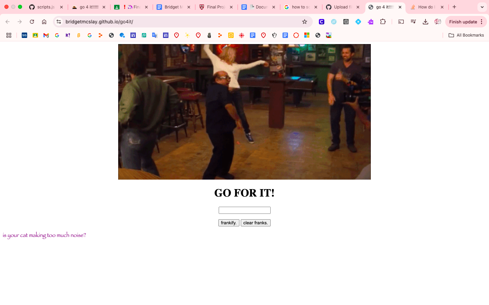

# Go 4 It: The Website
## by bridget McSlay

welcome to my website! made in html, javascript, and css, this awesome website features many photos of frank reynolds. also, almost all of the text is written in the awesome font of papyrus. this website is great for the casual as well as the not-so-casual iasip enjoyer. there's music, franks, joy, magic, and also a page with a fun fact about glenn howerton. What More Can You Ask For? 

p.s. ... I used the duck sometimes to help me debug... i'm not sure if i have to mention that or what but there you go! mostly for syntax and especially for the frankify button! thanks duck! 

